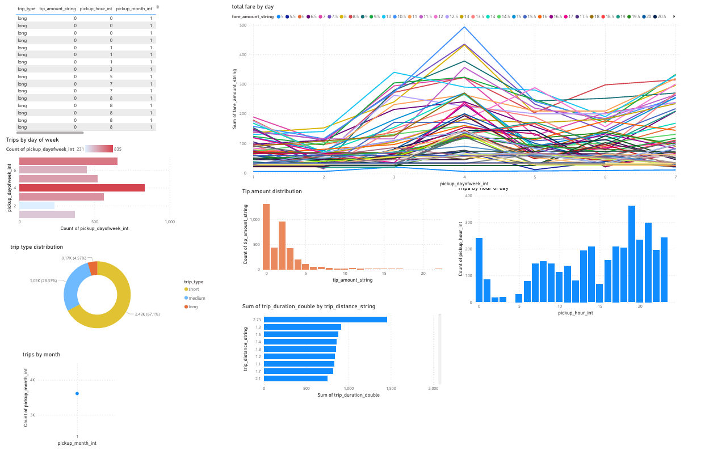

# NYC Taxi Analysis – Data Engineering & Machine Learning Pipeline

## 📌 Project Overview
This project demonstrates an **end-to-end data pipeline** and **machine learning system** built on the **NYC Taxi dataset**.  
It integrates **real-time data streaming, batch processing, analytics, and predictive modeling** into a unified architecture.

---

## 🚀 Architecture Workflow
1. **Data Ingestion**
   - **Kafka** simulates real-time taxi trip events.
   - **Amazon S3** stores historical batch data.

2. **Data Processing & Storage**
   - **AWS Glue** ETL scripts load and transform S3 data into **Amazon Redshift**.
   - **Amazon Redshift** serves as the central data warehouse.

3. **Analytics**
   - **Power BI Dashboard** connected to Redshift for interactive insights.

4. **Machine Learning**
   - Python module to train **Fare Prediction** and **ETA Prediction** models.
   - Models stored as **Pickle files in S3**.

5. **CI/CD & Automation**
   - **GitHub Actions Workflows**:
     - **Model Creation Workflow**: Triggered on merges to `model-creation` branch.
     - **Retrain Workflow**: Monthly cron job that retrains only if new data exceeds a defined threshold.

6. **Deployment**
   - **Flask API** fetches the latest ML model from S3 and exposes REST endpoints for predictions.

---

## ⚙️ Tech Stack
- **Data Streaming:** Apache Kafka  
- **Storage & ETL:** AWS S3, AWS Glue, Amazon Redshift  
- **Visualization:** Power BI  
- **Machine Learning:** Python (scikit-learn, pandas, numpy)  
- **Orchestration & CI/CD:** GitHub Actions (cron, branch triggers)  
- **Deployment:** Flask API  

---

## 📊 Features
- Real-time + batch data ingestion pipeline.  
- Automated ETL from S3 to Redshift for analytics.  
- Interactive Power BI dashboard for insights.  
- Automated ML model training and retraining workflows.  
- REST API for real-time fare and ETA predictions.  

---

## 🖼️ Architecture Diagram
*(Add your architecture diagram here if available – Kafka → S3 → Glue → Redshift → Power BI / ML → Flask API)*  

---

## 🚦 How to Run
1. Start Kafka to simulate streaming data.  
2. Load historical data into S3.  
3. Run Glue jobs to populate Redshift.  
4. Connect Power BI to Redshift for visualization.  
5. Use GitHub Actions to trigger model training/retraining.  
6. Run Flask API to serve predictions.  

---

## 📌 Future Improvements
- Add Airflow for workflow orchestration.  
- Deploy Flask API with Docker + AWS ECS/EKS.  
- Enhance ML pipeline with feature engineering and hyperparameter tuning.  

---

## 📝 Author
**Ashwin George**  
Data Engineering & Machine Learning Enthusiast
